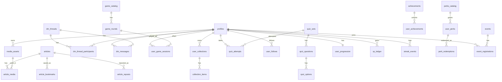

# nEUws Backend Schema (Polyglot Reader + Vocab)

Last updated: February 10, 2026

## 0) Agent Quick Start (Required)

This file is the backend source of truth for the polyglot reader + vocab system.

If you are an agent changing backend-related code, read these files in order:

1. `docs/backend_schema.md` (this file)
2. `lib/repositories/article_repository.dart`
3. `lib/repositories/supabase/supabase_article_repository.dart`
4. `lib/models/article_bundle.dart` and related models in `lib/models/`

Non-negotiable rules:

- Alignment storage base is canonical routing (`source -> canonical -> target`, O(N)).
- Offset encoding is `utf16_code_units` for all spans/alignments.
- Keep migration compatibility with legacy fields (`body_top`, `body_bottom`, `language_top`, `language_bottom`, `content`) until migration is complete.
- Use additive schema changes and preserve mock repo compatibility.

## Change Log

- 2026-02-10: Hardened rich seed flow (`docs/supabase_rich_seed.sql`) for enum/not-null schema variance and added profile-media storage bootstrap for upload testing.
- 2026-02-10: Added DM participant self-update RLS compatibility migration (`20260210143000_dm_participants_self_update.sql`) to support read-state updates from client message threads.
- 2026-02-10: Added DM thread RPC migration (`20260210144000_create_or_get_dm_thread_rpc.sql`) for create-or-open conversation flow from app contacts.
- 2026-02-10: Added DM realtime publication migration (`20260210145000_dm_realtime_publication.sql`) so inbox/thread UI receives instant Supabase realtime events.
- 2026-02-09: Added local troubleshooting scripts (`docs/supabase_smoke_check.sql`, `docs/supabase_minimal_seed.sql`) and run order for smoke-check + minimal data seed.
- 2026-02-09: Added rich local seed pack (`docs/supabase_rich_seed.sql`) for multi-account social/content testing (accounts, articles, DMs, collections, progression, events, quizzes).
- 2026-02-06: Added Supabase local run workflow (`.env/supabase.local.json`, `--dart-define-from-file`) and repository fallbacks for legacy article/learn schemas + unsigned profile fallback.
- 2026-02-06: Added migration recovery playbook (clean-reset SQL + strict rerun order) to handle legacy drift safely.
- 2026-02-06: Added progression legacy bootstrap migration to normalize older projects before `20260206174000_progression_rewards_events.sql`.
- 2026-02-06: Added quiz legacy compatibility patch migration for projects with `quiz_id` columns (`quiz_questions`, `quiz_attempts`) to prevent `quiz_set_id` migration failures.
- 2026-02-06: Added Sudoku + Eurodle game backend contract and seed migration (5 Sudoku skill points + 1 Eurodle base round).
- 2026-02-06: Added frontend wiring contracts for community domains (messages, saved, collections, perks, progression).
- 2026-02-06: Added profile compatibility patch migration for existing projects missing profile columns.
- 2026-02-06: Added progression/reward/events migration (`streaks`, `xp`, `achievements`, `perks`, `event_registrations`).
- 2026-02-06: Added migrations for polyglot core and social/media/games/quizzes/analytics domains.
- 2026-02-06: Added agent quick-start and explicit non-negotiable architecture rules.
- 2026-02-05: Initial schema, routing, alignment/json formats, query patterns, and migration plan.

## 1) ER-Style Overview (Tables + Relationships)

```mermaid
erDiagram
  articles ||--o{ article_localizations : has
  article_localizations ||--o{ article_alignments : from
  article_localizations ||--o{ article_alignments : to
  articles ||--o{ article_focus_vocab : has
  articles ||--o{ article_vocab_spans : has

  vocab_items ||--o{ vocab_forms : has
  vocab_items ||--o{ vocab_entries : has
  vocab_items ||--o{ article_focus_vocab : used_in
  vocab_items ||--o{ article_vocab_spans : highlighted_in

  profiles ||--o{ user_vocab_progress : tracks
  profiles ||--o{ user_vocab_events : logs

  vocab_items ||--o{ user_vocab_progress : learned_by
  vocab_items ||--o{ user_vocab_events : seen_in

  articles ||--o{ publishing_jobs : publishes
  profiles ||--o{ vocab_entry_suggestions : proposes
  vocab_items ||--o{ vocab_entry_suggestions : suggests_for
```

Routing example (canonical -> target):

```
FR tap -> align FR -> canonical -> align canonical -> SV
```

## 2) Key Decisions (Locked)

- Canonical routing: Store only canonical -> each translation alignments (O(N)).
  - Any pair resolves via canonical: FR -> canonical -> SV.
  - No precomputed N^2 pairs.
- Alignment strategy: Store alignment packs as JSON with canonical-to-translation spans.
  - Alignment packs are directional and stored per localization pair.
  - Inversion is computed at runtime (canonical <-> local).
- Text offset encoding: UTF-16 code unit offsets everywhere (Dart / Flutter native).
- Vocab item definition: A "vocab item" represents a canonical lemma + POS.
  - Language-specific forms (surface/lemma variants) live in `vocab_forms`.
  - Language-specific definitions/notes/examples live in `vocab_entries`.
- XP and streak architecture:
  - XP is append-only in `xp_ledger`; `user_progression` is derived/aggregated state.
  - Streaks derive from `streak_events` + DB trigger logic (not client-side counters).

## 3) SQL Schema (Supabase/Postgres)

Note: snake_case for SQL; camelCase in Dart models. Primary keys use UUIDs.

Migration files (authoritative executable SQL):

- `supabase/migrations/20260206164000_polyglot_core.sql`
- `supabase/migrations/20260206170000_social_content_analytics.sql`
- `supabase/migrations/20260206173000_progression_legacy_bootstrap.sql`
- `supabase/migrations/20260206174000_progression_rewards_events.sql`
- `supabase/migrations/20260206182000_games_sudoku_eurodle_seed.sql`
- `supabase/migrations/20260206190000_profile_compatibility_patch.sql`
- `supabase/migrations/20260206201000_quiz_legacy_compat_patch.sql`
- `supabase/migrations/20260210143000_dm_participants_self_update.sql`
- `supabase/migrations/20260210144000_create_or_get_dm_thread_rpc.sql`
- `supabase/migrations/20260210145000_dm_realtime_publication.sql`

The SQL block below is a conceptual core snapshot. Use migration files above as executable source of truth.

```sql
-- Content
create table if not exists articles (
  id uuid primary key default gen_random_uuid(),
  slug text unique not null,
  title text,
  excerpt text,
  topic text,
  category text,
  country_code text,
  country_tags text[],
  read_time_minutes int,
  image_asset text,
  hero_image_url text,
  language_top text,
  language_bottom text,
  body_top text,
  body_bottom text,
  canonical_lang text,
  canonical_localization_id uuid,
  is_published boolean default false,
  published_at timestamptz,
  created_at timestamptz default now()
);

create table if not exists article_localizations (
  id uuid primary key default gen_random_uuid(),
  article_id uuid not null references articles(id) on delete cascade,
  lang text not null,
  title text,
  excerpt text,
  body text not null,
  content_hash text,
  version int default 1,
  created_at timestamptz default now(),
  unique (article_id, lang)
);

create table if not exists article_alignments (
  id uuid primary key default gen_random_uuid(),
  article_id uuid not null references articles(id) on delete cascade,
  from_localization_id uuid not null references article_localizations(id) on delete cascade,
  to_localization_id uuid not null references article_localizations(id) on delete cascade,
  alignment_json jsonb not null,
  algo_version text,
  quality_score numeric,
  created_at timestamptz default now(),
  unique (from_localization_id, to_localization_id)
);

-- Vocabulary
create table if not exists vocab_items (
  id uuid primary key default gen_random_uuid(),
  canonical_lang text not null,
  canonical_lemma text not null,
  pos text,
  difficulty text,
  created_at timestamptz default now()
);

create table if not exists vocab_forms (
  id uuid primary key default gen_random_uuid(),
  vocab_item_id uuid not null references vocab_items(id) on delete cascade,
  lang text not null,
  lemma text,
  surface text not null,
  notes text
);

create table if not exists vocab_entries (
  id uuid primary key default gen_random_uuid(),
  vocab_item_id uuid not null references vocab_items(id) on delete cascade,
  lang text not null,
  primary_definition text,
  usage_notes text,
  examples text[],
  tags text[],
  updated_at timestamptz default now(),
  updated_by uuid,
  source text,
  unique (vocab_item_id, lang)
);

create table if not exists article_focus_vocab (
  article_id uuid not null references articles(id) on delete cascade,
  vocab_item_id uuid not null references vocab_items(id) on delete cascade,
  rank int not null default 1,
  created_at timestamptz default now(),
  unique (article_id, vocab_item_id)
);

create table if not exists article_vocab_spans (
  article_id uuid not null references articles(id) on delete cascade,
  vocab_item_id uuid not null references vocab_items(id) on delete cascade,
  localization_id uuid not null references article_localizations(id) on delete cascade,
  spans_json jsonb not null,
  unique (article_id, vocab_item_id, localization_id)
);

-- Users
create table if not exists user_vocab_progress (
  user_id uuid not null references profiles(id) on delete cascade,
  vocab_item_id uuid not null references vocab_items(id) on delete cascade,
  level text not null default 'bronze',
  xp int not null default 0,
  last_seen_at timestamptz,
  next_review_at timestamptz,
  unique (user_id, vocab_item_id)
);

create table if not exists user_vocab_events (
  id uuid primary key default gen_random_uuid(),
  user_id uuid not null references profiles(id) on delete cascade,
  vocab_item_id uuid not null references vocab_items(id) on delete cascade,
  article_id uuid references articles(id) on delete set null,
  event_type text not null,
  occurred_at timestamptz default now(),
  meta_json jsonb
);

create table if not exists user_article_reads (
  user_id uuid not null references profiles(id) on delete cascade,
  article_id uuid not null references articles(id) on delete cascade,
  read_at timestamptz default now(),
  unique (user_id, article_id)
);

-- Moderation
create table if not exists vocab_entry_suggestions (
  id uuid primary key default gen_random_uuid(),
  vocab_item_id uuid not null references vocab_items(id) on delete cascade,
  lang text not null,
  suggestion_type text not null,
  proposed_text text,
  proposed_examples text[],
  proposed_tags text[],
  proposer_user_id uuid references profiles(id) on delete set null,
  status text not null default 'pending',
  reviewed_by uuid references profiles(id) on delete set null,
  reviewed_at timestamptz,
  review_note text,
  created_at timestamptz default now()
);

-- Publishing pipeline
create table if not exists publishing_jobs (
  id uuid primary key default gen_random_uuid(),
  article_id uuid not null references articles(id) on delete cascade,
  status text not null default 'queued',
  step text,
  error text,
  created_at timestamptz default now(),
  updated_at timestamptz default now()
);

create index if not exists idx_article_localizations_article on article_localizations(article_id);
create index if not exists idx_article_alignments_article on article_alignments(article_id);
create index if not exists idx_article_focus_vocab_article on article_focus_vocab(article_id);
create index if not exists idx_article_vocab_spans_article on article_vocab_spans(article_id);
create index if not exists idx_user_vocab_progress_user on user_vocab_progress(user_id);
create index if not exists idx_user_vocab_events_user on user_vocab_events(user_id);
```

RLS notes (recommendations):

- Public read access for published articles, localizations, alignments, and vocab entries/forms.
- User-scoped access for `user_vocab_progress`, `user_vocab_events`, `user_article_reads`.
- `vocab_entry_suggestions` insert allowed for authenticated users; update restricted to moderators.
- `publishing_jobs` insert limited to service role or edge function; select for admin/staff.

Publishing job state guidance:

- `status`: `queued | running | completed | failed`
- `step`: example values `read_canonical`, `translate`, `align`, `select_focus_vocab`, `build_vocab_entries`, `compute_spans`, `writeback`
- Worker is responsible for setting `status`, `step`, `error`, and `updated_at`.

## 4) JSON Formats

Alignment pack (canonical -> translation):

```json
{
  "version": 1,
  "source_lang": "en",
  "target_lang": "fr",
  "offset_encoding": "utf16_code_units",
  "units": [
    { "c": [120, 132], "t": [98, 110], "score": 0.92 },
    { "c": [133, 146], "t": [111, 129], "score": 0.84 }
  ]
}
```

Vocab spans (per localization, UTF-16 offsets):

```json
{
  "version": 1,
  "offset_encoding": "utf16_code_units",
  "spans": [
    { "start": 240, "end": 252, "surface": "loyalty", "lemma": "loyalty" },
    { "start": 410, "end": 419, "surface": "dismissals", "lemma": "dismissal" }
  ]
}
```

Sudoku round payload (`game_rounds.compact_payload`):

```json
{
  "puzzle_grid": "530070000600195000098000060800060003400803001700020006060000280000419005000080079",
  "solution_grid": "534678912672195348198342567859761423426853791713924856961537284287419635345286179",
  "skill_point": 5
}
```

Eurodle round payload (`game_rounds.compact_payload`):

```json
{
  "target_word": "union",
  "word_length": 5,
  "max_attempts": 6,
  "allowed_words": ["union", "voter", "euros", "treat", "eurox"],
  "hint": "Shared political and economic project."
}
```

## 5) Query Patterns (App Reads)

When opening an article (polyglot reader):

1. `articles` by `slug` -> get `id`, `canonical_lang` (or fallback), optional `canonical_localization_id`.
2. `article_localizations` for canonical + top + bottom languages.
3. `article_alignments` where `from_localization_id = canonical` and `to_localization_id` in {top, bottom}.
4. `article_focus_vocab` -> `vocab_items`, `vocab_entries` for UI language, `vocab_forms` for top/bottom languages.
5. `article_vocab_spans` for focus vocab (optional; used for inline highlight and word collection).

Current app contract mapping:

- Existing screen path still uses legacy detail fields through `getArticleDetailBySlug`.
- New polyglot/vocab bundle path is `getArticleBundleBySlug(slug, topLang, bottomLang, uiLang)`.
- Bundle model includes canonical/top/bottom localizations, canonical->top and canonical->bottom alignment packs, and focus vocab payload.
- Games repository now exposes:
  - `getSudokuSkillRounds()`
  - `getSudokuRoundBySkillPoint(skillPoint)`
  - `getActiveEurodleRound()`
- Community repository exposes:
  - `getMessageThreads()`
  - `getMessageContacts()`
  - `getSavedArticles()`
  - `getUserCollections()`
  - `getUserPerks()`
  - `getUserProgression()`
  - `getRepostedArticles()`

When collecting words:

1. Insert `user_vocab_events` for each focus vocab item (event_type: `seen`, `collect`).
2. Upsert `user_vocab_progress` to bump xp/level and update review fields.

When showing collection:

1. `user_vocab_progress` by user_id (grouped by level).
2. Join `vocab_entries` (ui language) + `vocab_forms` (current study language) for display.

When opening profile/progression:

1. Fetch `user_progression` (total xp, level, streaks).
2. Fetch recent `xp_ledger` rows (`created_at DESC`) for timeline.
3. Fetch `user_achievements` + `achievements` and `user_perks` + `perks_catalog`.

When opening events:

1. Fetch upcoming `events` (`is_published = true`, `start_at ASC`).
2. Fetch user `event_registrations` for join/check-in/completion state.
3. On completion, write `event_activity_events`, optional `xp_ledger`, optional `user_perks`.

When opening games (Sudoku + Eurodle):

1. Resolve `game_catalog.id` by slug (`sudoku`, `eurodle`).
2. Sudoku skill list:
   - fetch `game_rounds` where `game_id = sudoku`, `is_active = true`, `skill_point between 1 and 5`
   - sort by `skill_point ASC, published_at DESC`
   - pick latest row per skill point in repository layer
3. Sudoku single skill point:
   - fetch latest by `skill_point` with `published_at DESC limit 1`
4. Eurodle active:
   - fetch latest active `game_rounds` row for `eurodle` by `published_at DESC limit 1`

When opening community surfaces:

1. Messages tab:
   - `dm_thread_participants` for current user
   - latest `dm_messages` grouped by thread
   - counterpart `profiles` for display names
2. Saved tab:
   - `article_bookmarks` by user -> `articles` by ids
3. Perks tab:
   - `user_perks` by user -> `perks_catalog` by ids
4. You tab (collections/reposts/progression):
   - `user_collections` + `collection_items` counts
   - `article_reposts` -> `articles`
   - `user_progression` for xp/level/streak snapshot

## 6) Migration Path / Compatibility

Existing fields (`body_top`, `body_bottom`, `language_top`, `language_bottom`, `content`) remain supported during migration:

- Phase A: dual-write from publishing pipeline into both `articles.body_*` and `article_localizations`.
- Phase B: reader UI starts using `article_localizations` + `article_alignments`.
- Phase C: remove UI dependency on `body_top/body_bottom` but keep columns until old clients are sunset.

Compatibility rules:

- If `article_localizations` is missing for a language, fall back to `articles.body_top/body_bottom`.
- `articles.canonical_lang` is optional; default to `language_top` until backfilled.
- `article_alignments` may be missing for early content; reader should degrade to non-aligned display.
- If legacy event rows exist, add progression fields additively (`completion_xp`, `completion_perk_id`) and keep old event consumers functional.

## 7) Publishing Pipeline Responsibilities (Where Computation Happens)

Storage is in Supabase; heavy computation is in an external worker/service:

1. Read canonical localization from Supabase.
2. Generate translations (LLM/API).
3. Compute canonical->translation alignment packs (LLM or alignment model).
4. Select 3-5 focus vocab items (human or LLM suggestion + approval).
5. Generate vocab entries per language (definitions/notes/examples).
6. Compute article_vocab_spans per localization.
7. Write results back to Supabase and mark `publishing_jobs` complete.

Edge Function may start a job by creating `publishing_jobs` rows, but heavy work must run off-platform.

## 8) Extended Product Domains (Server-Side)

The following domains are now part of backend structure and migrations:

- Messaging (DMs):
  - `dm_threads`, `dm_thread_participants`, `dm_messages`, `dm_message_reads`
- Media:
  - `media_assets` (single source for avatars, wallpapers, article/quiz/game images)
  - `article_media` for article-scoped media slots
  - Optional links: `articles.hero_media_id`, `article_localizations.hero_media_id`, `profiles.avatar_media_id`, `profiles.wallpaper_media_id`
- Games:
  - `game_catalog`, `game_rounds`, `user_game_sessions`, `user_game_events`
  - Sudoku is stored as compact number strings in `compact_payload` with `skill_point` (1-5).
  - Eurodle is stored as compact payload (`target_word`, attempts, allowed words, hint).
- Quizzes:
  - `quiz_sets`, `quiz_questions`, `quiz_options`, `quiz_attempts`, `quiz_attempt_answers`
- User graph + library:
  - `user_follows`, `user_settings`, `article_bookmarks`, `user_collections`, `collection_items`, `article_reposts`
- Progression + rewards:
  - `progression_levels`, `user_progression`, `xp_ledger`, `streak_events`
  - `achievements`, `user_achievements`, `perks_catalog`, `user_perks`, `perk_redemptions`
- Events:
  - `events`, `event_registrations`, `event_activity_events`
- Retention + counters:
  - `article_engagement_events`, `article_counters`, `article_metrics_daily`, `user_stats`
- Safety + notifications:
  - `notifications`, `user_blocks`, `reports`

Domain relation sketch:



## 9) Sorting and Fetch Logic (Performance-Focused)

Sort contracts (lock these to keep behavior predictable):

- Home feed:
  - default: `published_at DESC, id DESC` for deterministic pagination
  - topic feed: filter by topic, same ordering
  - future ranking path: precomputed score table + secondary `published_at DESC`
- DMs:
  - thread list: `last_message_at DESC, id DESC`
  - message list in thread: `created_at DESC, id DESC` with cursor pagination
- Collections:
  - if `sort_order` set: `sort_order ASC, created_at DESC`
  - fallback: `created_at DESC`
- Followers/following:
  - `created_at DESC` with keyset pagination
- Game rounds:
  - active rounds: `is_active = true`, `published_at DESC`
  - Sudoku progression list: `skill_point ASC`, latest round per skill point
  - Eurodle daily/latest: `published_at DESC, id DESC`
- Quiz discovery:
  - `is_published = true`, then `created_at DESC` or topic-specific sort
- Events:
  - upcoming list: `is_published = true` and `start_at ASC, id ASC`
  - user registrations: `registered_at DESC`
- Progression and rewards:
  - XP history: `created_at DESC, id DESC`
  - achievements: unlocked first (`achieved_at DESC`), then in-progress by `progress_value DESC`
  - active perks: `status = 'available'` and nearest `expires_at ASC`
- User drafts/articles:
  - same table (`articles`) split by `is_published` + `author_id`
  - order by `updated_at DESC` for drafts, `published_at DESC` for published

Pagination rules:

- Prefer keyset/cursor pagination over OFFSET for feeds/messages.
- Use `(created_at, id)` or `(published_at, id)` cursor pair.
- Keep composite indexes aligned with sort columns.

## 10) Retention and Metrics Strategy

Minimum tracked metrics now supported:

- demographics (coarse):
  - `profiles.gender`, `profiles.age_bracket`, optional `profiles.birth_year`
- article interactions:
  - clicks/opens/time spent through `article_engagement_events`
  - saves via `article_bookmarks`
  - reposts via `article_reposts`
- progression interactions:
  - XP grants through `xp_ledger` (`source_type`, `source_id`, `dedupe_key`)
  - streak continuity through `streak_events`
  - achievement unlock/claim state through `user_achievements`
- events interactions:
  - participation lifecycle through `event_registrations` and `event_activity_events`
- pre-aggregated counters:
  - `article_counters.click_count`
  - `article_counters.open_count`
  - `article_counters.save_count`
  - `article_counters.repost_count`
  - `article_counters.total_read_ms`

Performance model:

- write path: append event rows + lightweight counter bumps
- read path: use `article_counters` for hot surfaces (list screens, cards)
- analytics path: periodic rollups into `article_metrics_daily`

Privacy note:

- Prefer storing age bracket over exact birthdate where possible.
- Keep demographic collection optional and product-policy controlled.

## 11) Smooth-Scale Guardrails

- Keep JSON for flexible payloads only (`game_rounds.compact_payload`, event metadata).
- Keep filter/sort keys as normal typed columns and indexed.
- Avoid cross-domain joins on hot paths; fetch in 2-3 targeted queries and merge in repository layer.
- Use `updated_at` triggers only where row freshness is needed for sorting.
- Maintain compatibility fields during migration windows; remove only after client sunset.

## 12) Frontend Wiring Matrix

Current page -> backend/provider integration:

- `lib/screens/games_page.dart`
  - `sudokuSkillRoundsProvider`
  - `eurodleRoundProvider`
- `lib/screens/quiz_categories_page.dart`, `lib/screens/quiz_play_page.dart`
  - `quizCategoriesProvider`
  - `quizByIdProvider`
- `lib/screens/messages_page.dart`
  - `messageThreadsProvider`
  - `messageContactsProvider`
- `lib/screens/saved_page.dart`
  - `savedArticlesProvider`
- `lib/screens/perks_page.dart`
  - `userPerksProvider`
- `lib/screens/you_page.dart`
  - `userProgressionProvider`
  - `userCollectionsProvider`
  - `repostedArticlesProvider`
  - `messageContactsProvider`
- `lib/screens/settings_page.dart`
  - `settingsProvider` read + `saveSettings` write path
- `lib/screens/home_page.dart`
  - `userProgressionProvider` + `userPerksProvider` snapshot card

## 13) XP, Streaks, Achievements, Perks, Events (Operational Logic)

XP flow:

1. Client/worker inserts append-only `xp_ledger` row.
2. Trigger updates `user_progression.total_xp` and recomputes `level` from `progression_levels`.
3. Optional notifier/worker evaluates achievement conditions and writes `user_achievements`.

Streak flow:

1. Client/worker inserts one `streak_events` row per activity date/type.
2. Trigger updates `user_progression.current_streak_days`, `best_streak_days`, and `last_activity_date`.
3. Duplicate same-day events are prevented by unique `(user_id, activity_date, activity_type)`.

Achievement flow:

1. Definitions live in `achievements` (`condition_json`, optional `xp_reward`).
2. User state lives in `user_achievements` (`progress_value`, `achieved_at`, `claimed_at`, `claim_status`).
3. Claiming may grant XP (`xp_ledger`) and/or perks (`user_perks`).

Perk flow:

1. Definitions live in `perks_catalog` (`perk_type`, `duration_days`, `max_uses`).
2. Grants create `user_perks` rows with `status`, `expires_at`, `remaining_uses`.
3. Uses are logged in `perk_redemptions`.

Events flow:

1. Catalog rows in `events` include optional `completion_xp` and `completion_perk_id`.
2. User state in `event_registrations` tracks `registered`, `checked_in`, and `completed`.
3. Completion can create XP/perk grants and audit trail rows in `event_activity_events`.

## 14) Migration Operations Runbook (Important)

Use this when setting up a real Supabase project (especially older projects with legacy tables).

Rules:

- Treat `supabase/migrations/` files as source of truth.
- Run files in timestamp order only.
- If migration errors indicate missing columns on existing tables, do a clean domain reset and rerun (do not hot-edit historical SQL in dashboard).
- Use new patch migrations for compatibility fixes; keep changes additive.

Strict run order:

1. `20260206164000_polyglot_core.sql`
2. `20260206170000_social_content_analytics.sql`
3. `20260206173000_progression_legacy_bootstrap.sql`
4. `20260206174000_progression_rewards_events.sql`
5. `20260206182000_games_sudoku_eurodle_seed.sql`
6. `20260206190000_profile_compatibility_patch.sql`
7. `20260206201000_quiz_legacy_compat_patch.sql`

If legacy drift blocks setup, use this clean reset (drops only neuws domain tables, not `auth.users`, not base `profiles`/`articles`):

```sql
begin;

drop table if exists
  public.event_activity_events,
  public.event_registrations,
  public.events,
  public.perk_redemptions,
  public.user_perks,
  public.perks_catalog,
  public.user_achievements,
  public.achievements,
  public.streak_events,
  public.xp_ledger,
  public.user_progression,
  public.progression_levels,
  public.article_metrics_daily,
  public.article_counters,
  public.article_engagement_events,
  public.reports,
  public.user_blocks,
  public.notifications,
  public.article_reposts,
  public.collection_items,
  public.user_collections,
  public.article_bookmarks,
  public.user_settings,
  public.user_follows,
  public.quiz_attempt_answers,
  public.quiz_attempts,
  public.quiz_options,
  public.quiz_questions,
  public.quiz_sets,
  public.user_game_events,
  public.user_game_sessions,
  public.game_rounds,
  public.game_catalog,
  public.dm_message_reads,
  public.dm_messages,
  public.dm_thread_participants,
  public.dm_threads,
  public.article_media,
  public.media_assets,
  public.publishing_jobs,
  public.vocab_entry_suggestions,
  public.user_article_reads,
  public.user_vocab_events,
  public.user_vocab_progress,
  public.article_vocab_spans,
  public.article_focus_vocab,
  public.vocab_entries,
  public.vocab_forms,
  public.vocab_items,
  public.article_alignments,
  public.article_localizations
cascade;

commit;
```

## 15) Local Run Modes

- Mock mode (no Supabase values): `flutter run -d edge`
- Supabase mode (local dev):
  - create `.env/supabase.local.json` from `.env/supabase.local.example.json`
  - run `flutter run -d edge --dart-define-from-file=.env/supabase.local.json`
- Supabase mode (hosted project):
  - use hosted `SUPABASE_URL` + `SUPABASE_ANON_KEY` in `.env/supabase.local.json`
  - run `flutter run -d edge --dart-define-from-file=.env/supabase.local.json`
  - use pooler DB credentials (`postgres.<project_ref>`) only for psql/admin SQL, not as app auth user

Notes:

- `.env/supabase.local.json` is the standard app runtime define file even when connecting to hosted Supabase (name is historical).
- End users never provide keys; keys are build-time config.
- Service role key must never ship in the client.
- For psql/admin connection runbook and common connection errors, see `docs/supabase_connection.md`.

## 16) Smoke Check + Seed Packs (Local Troubleshooting)

Use these scripts after migrations when app surfaces are empty or failing due to missing runtime data:

- `docs/supabase_smoke_check.sql`
  - verifies critical tables/columns exist
  - reports basic published/active row counts
- `docs/supabase_minimal_seed.sql`
  - inserts one published article
  - inserts one published quiz set with one question/options
  - inserts one published event
  - uses idempotent inserts where possible for repeatable local setup
- `docs/supabase_rich_seed.sql`
  - seeds 6 auth/profile accounts (1 tester + 5 creators)
  - seeds 5 published creator articles + localizations + focus vocab
  - seeds follows, DM threads/messages, saved/reposts/collections
  - seeds perks/progression/streak/events + event registrations
  - seeds multiple quiz sets/questions/options for Learn/Quiz flows
  - schema-adaptive enum coercion + required-column guards for drifted projects
  - bootstraps `public-media` storage bucket + policies for profile image testing
  - prints seeded account credentials at the end for quick sign-in

Suggested order:

1. run migrations in strict order from section 14
2. run `docs/supabase_smoke_check.sql`
3. run one seed pack:
   - minimal: `docs/supabase_minimal_seed.sql`
   - full UX/content testing: `docs/supabase_rich_seed.sql`
4. run `docs/supabase_smoke_check.sql` again and verify non-zero content counts
